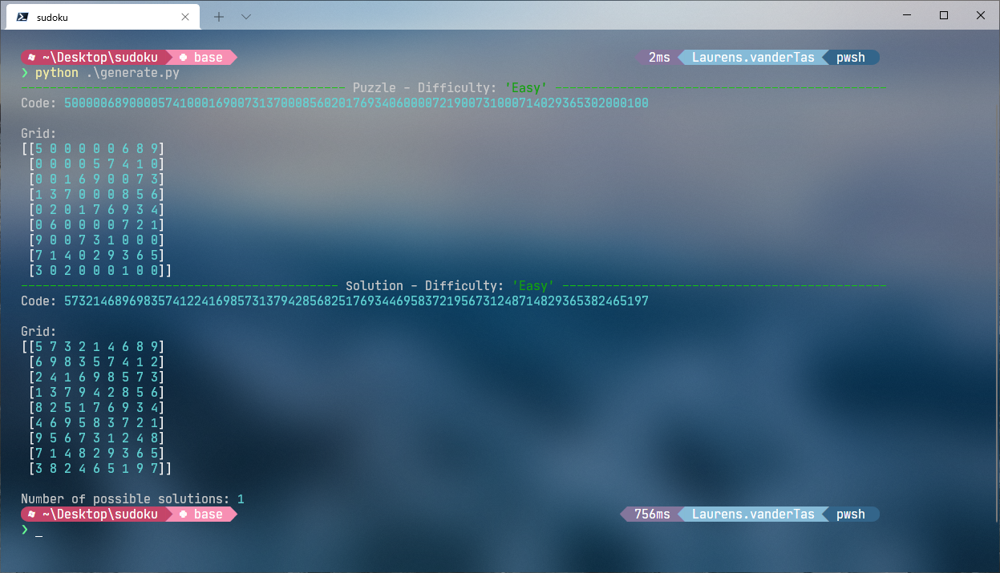
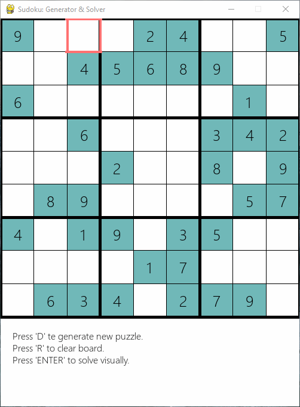

# 1. Sudoku Puzzles

- [1. Sudoku Puzzles](#1-sudoku-puzzles)
  - [1.1. Allereerst](#11-allereerst)
  - [1.2. Installatie](#12-installatie)
  - [1.3. Gebruik](#13-gebruik)
    - [1.3.1. Moeilijkheidsgraad](#131-moeilijkheidsgraad)
    - [1.3.2. Puzzels genereren](#132-puzzels-genereren)
    - [1.3.3. Puzzels genereren, visualiseren en oplossen](#133-puzzels-genereren-visualiseren-en-oplossen)

## 1.1. Allereerst

Hey Lisette,

Ik heb dit voor je gemaakt ter ere van onze fijne samenwerking bij DELTA Fiber. Anne Frances had het idee om, naast een standaard cadeau, puzzels voor je te verzamelen. Ik heb er dus even een klein projectje van gemaakt om het iets creatiever te doen.

Ik wens jou, je partner en de kinderen het allerbeste, en ik wens je heel veel succes bij je nieuwe baan! :smile:

Groetjes,

Laurens

## 1.2. Installatie

Benodigdheden:

* Python 3

Voer het volgende uit vanuit de map om de benodigde packages te installeren:

```
pip install -r requirements.txt
```

## 1.3. Gebruik

### 1.3.1. Moeilijkheidsgraad

Open `settings.yml` en pas de `difficulty_choice` aan naar keuze. Deze instelling geldt voor zowel het script om puzzels te genereren via de _command line_, als voor de visuele applicatie.

```yml
difficulty_levels:
  0: Easy
  1: Medium
  2: Hard

# Set difficulty here
difficulty_choice: 0
```

### 1.3.2. Puzzels genereren

Om alleen een puzzel te generen, met de oplossing erbij als referentie, kun je `generate.py` gebruiken.

```
python generate.py
```



* `Code` is de volledige geserialiseerde puzzel.
  * De eerste negen waarden vertegenwoordigen de eerste rij, de volgende de tweede rij, enz.
* `Grid` is een visuele representatie van hoe de puzzel er 'op papier' ongeveer uit zou zien.
* De waarden die je in moet vullen, worden vertegenwoordigd door `0`.

### 1.3.3. Puzzels genereren, visualiseren en oplossen

Om puzzels visueel te genereren en op te laten lossen, kun je `app.py` gebruiken.

```
python app.py
```



* Dit is een simpele GUI applicatie die de puzzel toont en geanimeerd op kan lossen.
  * Druk op `D` om een nieuwe puzzel te genereren (volgens je moeilijkheidsgraad in `settings.yml`).
  * Druk op `Enter` om de puzzel op te laten lossen.
  * Druk op `R` om het canvas leeg te halen.

* __N.B.__
  * Als het programma opstart, kun je eerst eventjes een zwart scherm zien terwijl hij op de achtergrond de puzzel genereert en de interface opbouwt.
  * Het algoritme waarmee ik de puzzels oplos, is een simpel _recursive backtracking_ algoritme. Deze is vrij dom en traag, dus wees voorbereid :smile:.
  * Je kunt in de interface de puzzel ook invullen, alleen als je een nummer fout hebt dan vult hij hem niet in.
  * Ik heb de applicatie niet super robuust geprogrammeerd en niet geoptimaliseerd. Anders zou het heel veel tijd kosten :laughing:.
